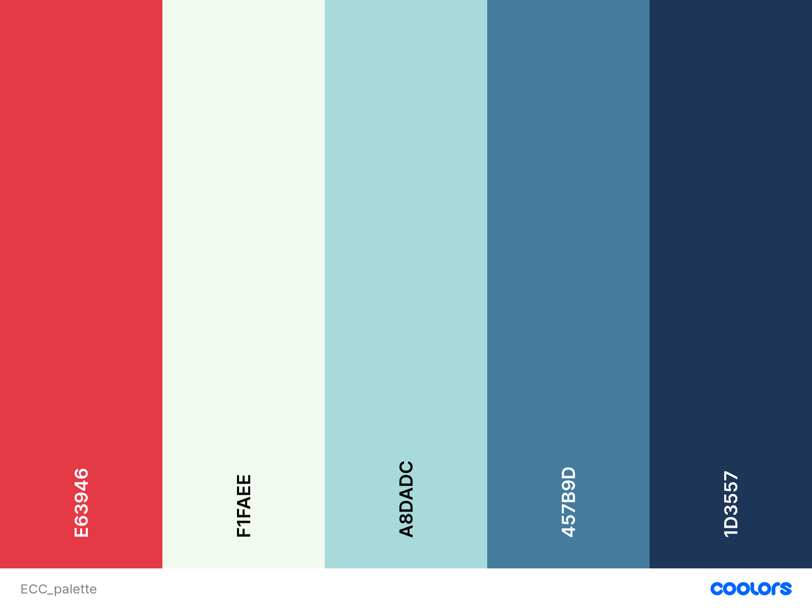

# EternalCityCrawls
Half/Full Day Tour of Rome developed by Django

## Table of contents
<!--ts-->

# UX

## User goals

The target audience of **Eternal Cities Crawls** is:
- Local People interested in unusual visit of their own city.
- First Time Visitors with little time available, interested to see the most important.
- Food Lovers interested to combine visits with local food.

User goals:
- Browse the tour Catalogues and order them by type and duration.
- Be able to see preview image of destination, price and details of the tour.
- Book a specific tour along with the number of participants, adding it to the cart page.
- Check on the personal profile page the booking they have in place
- Add Multiple tour to the Cart Page
- Log on the Personal Profile Page
- Checkout using card payment.
- Find information about the tour operators such as address phone number and its mission.
- Read Previous Customer's feedbacks.
- Receive information about the status of his/her payment.

## Design

### Color Scheme
Following color Palette has been adopted; the main background color used is Panache(`#F1FAEE`) or Conch(`#A8ADAC`) as an alternative; those two colours are dominating the application. Other Elements, such Button and Navbar are using Nordic (`#1D3537`) or a gradient of it with Jelly Bean(`#457B9D`). Amaranth(`#E63946`) has been used as an element of contrast, in the footer or for some button.

## Wireframes

Wireframe mockups, created using [Balsamiq](https://balsamiq.com/), are available in diffent format:

 1. Laptop
    1. [Landing](static/img/wireframes/landing/LandingLaptop.pdf)
 1. Tablet
     1. [Landing](static/img/wireframes/landing/LandingTablet.pdf)

 1. Mobile
     1. [Landing](static/img/wireframes/landing/LandingMobile.pdf)

