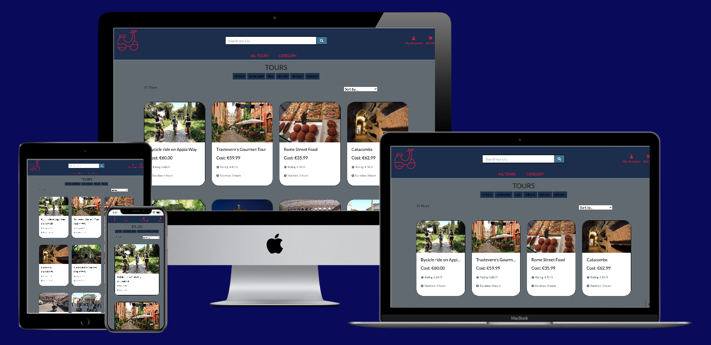

# EternalCityCrawls

E-commerce application designed for a Tour Agency, Eternal City Crawls is focused on selling Rome's Tour. The back-end infrastructure has been developed on Django, while front-end relies on a combination of vanilla JavaScript and Jquery.




## Table of contents
<!--ts-->
1. [UX](#ux)
    - [User Stories](#user-stories)
    - [Design](#design)
        - [Framework](#framework)
        - [Color Scheme](#color-Scheme)
        - [Icons](#icons)
        - [Typography](#typography)
    - [Wireframes](#wireframes)
1. [Features](#features)
    - [Existing Features](#existing-features)
        - [Navbar](#navbar)
        - [Footer](#footer)
        - [Landing Page](#landing-page)
            - [Top Rating Carousel](#top-rating-carousel)
            - [Testimonials](#testimonials)
            - [Contact Section](#contact)
        - [Tour Page](#tour-page)
        - [Tour Management Page](#tour-management-page)
        - [Tour Detail Page](#tour-detail-page)
        - [Cart Page](#cart-page)
        - [Checkout Page](#checkout-page)
        - [Checkout Process](#login-page)
        - [Registration Page](#registration-page)
        - [404 Page](#404-page)
        - [500 Page](#500-page)
    - [Features Left to Implement](#features-left-to-implement)
1. [Information Architecture](#information-architecture)
    - [Database choice](#database-choice)
    - [Data Model](#data-model)
1. [Technologies Used](#technologies-used)
    - [Tools](#tools)
    - [Libraries](#libraries)
1. [Testing](#testing)
1. [Deployment](#deployment)
    - [How to run this project locally](#how-to-run-this-project-locally)
    - [Heroku Deployment](#heroku-deployment)
1. [Credits](#credits)
    - [Code](#code)
    - [Images](#images)
    - [Acknowledgements](#acknowledgements)
1. [Contacts](#contact)
1. [Disclaimer](#disclaimer)

# UX

## User Stories

The target audience of **Eternal Cities Crawls** is:
- Local People interested in unusual visit of their own city.
- First Time Visitors with little time available, interested to see the most important.
- Food Lovers interested to combine visits with local food.
- Tour Agency Managers, looking for an easy interface to manage and present their offering.

User goals can be split in goal for the user of the site:
- As a user, I want to be able to easily register.
- As a user, I want to receive a mail in case of successful registration.
- As a user, I want to be able to reset my password in case I forgot.
- As a user, I want to be able to Log on my Personal Profile Page.
- As a user, I want to check on the personal profile page the booking I had in the past.
- As a user, I want to read Previous Customer's feedbacks.

Goal for the customer:
- As a customer, I want to browse the tour Catalogues and order them by type, duration and rating.
- As a customer, I want to filter tours for the categories of interest.
- As a customer, I want to see preview image of destination, price and details of the tour.
- As a customer, I want to book a specific tour along with the number of participants, adding it to the cart page.
- As a customer, I want to Add Multiple tour to the Cart Page.
- As a customer, I want to remove items in my card.
- As a customer, I want to change participants to the tour in my cart.
- As a customer, I want to checkout using card payment.
- As a customer, I want to use the most secure form of payment.
- As a customer, I want to Receive information about the status of his/her payment.

And Goal specifically addressed to the Agency Manager:
- As an Agency Manager, I want to update my Tour offering.
- As an Agency Manager, I want to insert new Tours in the catalogue.
- As an Agency Manager, I want to remove a Tours from the catalogue.

## Design
### Framework
- [jQuery](https://code.jquery.com/jquery/)
    - **jQuery** for its semplicity of use has been selected to improve reactivity of the site. It was not possible to use minified version or latest version( 3.5.1) for compatibility issues.
- [Django](https://www.djangoproject.com/)
    - a Python-based free and open-source web framework that follows the **model-template-views** (MTV) architectural pattern.

### Color Scheme
Following color Palette has been adopted; the main background color used is Panache(`#F1FAEE`) or Conch(`#A8ADAC`) as an alternative; those two colours are dominating the application. Other Elements, such Button and Navbar are using Nordic (`#1D3537`) or a gradient of it with Jelly Bean(`#457B9D`). Amaranth(`#E63946`) has been used as an element of contrast, in the footer or for some button.


### Icons
- [Font Awesome 5.13](https://fontawesome.com/) 
    - all icons have been source from more than 1000 available in fontawesome.

### Typography
I have used some [Google Fonts](https://fonts.google.com/) all over the Website: 
* I have selected for all titles [Amita](https://fonts.google.com/specimen/Amita), because it seems appropriate for the Fantastic settings many Boardgames have. 
* I have used also [Satisfy](https://fonts.google.com/specimen/Satisfy) for Brand logo.
* Beside those, all others font are the build-in Bootstrap ones.

## Wireframes

Wireframe mockups, created using [Balsamiq](https://balsamiq.com/), are available in diffent format:

 1. Laptop
    1. [Landing](wireframes/landing/LandingLaptop.pdf)
    1. [Tour](wireframes/search/SearchLaptop.pdf)
    1. [Tour Details](wireframes/tour/TourLaptop.pdf)
    1. [Checkout Main](wireframes/checkout/CheckoutMainLaptop.pdf)
    1. [Checkout Details](wireframes/checkout/CheckoutDetailsLaptop.pdf)
 1. Tablet
     1. [Landing](wireframes/landing/LandingTablet.pdf)
     1. [Tour](wireframes/search/SearchTablet.pdf)
     1. [Tour Details](wireframes/tour/TourTablet.pdf)
     1. [Checkout Main](wireframes/checkout/CheckoutMainTablet.pdf)
     1. [Checkout Details](wireframes/checkout/CheckoutDetailsTablet.pdf)
 1. Mobile
     1. [Landing](wireframes/landing/LandingMobile.pdf)
     1. [Tour](wireframes/search/SearchMobile.pdf)
     1. [Tour Details](wireframes/tour/TourMobile.pdf)
     1. [Checkout Main](wireframes/checkout/CheckoutMainMobile.pdf)
     1. [Checkout Details](wireframes/checkout/CheckoutDetailsMobile.pdf)


Modals not dependent on the device:

   1. [Log in](static/img/wireframes/login/login.pdf)
   1. [Register](static/img/wireframes/login/registration.pdf)


# Features

## Existing Features

### Elements on every page

#### Navbar

The navigation bar is sticky, and show Eternal city crawl log on the left, that can be clicked to redirect the user to the main
page. On *Django* **back-end** the user is checked and the navbar can have 2 distinct aspect, whether the user is logged on or not; is worth to mention that all the controls and the status of the user are managed via the context within the Django Template; there is also a strong emphasis on defensive design in **back-end**, to prevent rogue navigation to section which require log-in.

All Visitors have access to 2 distinct drop down:

- All Tours Drop Down Menu containing link to tour page with ordering:
    1. by cost
    2. by category
    3. by rating

- Category Drop Down Menu containing link to each category:


For visitors to the site who are not logged in, following drop-down items links are available for them to use:

- My Account containing:
    1. Log-in
    1. Register   

- Cart

Cart is available for anonymous purchasing.

For users who are logged in, the list items are as follows:

- Profile name drop down containing:
    1. Log-out
    1. Register   

- Cart

Only Super-user will see Tour Management link in their account; the navbar will change format for small screen, presenting a *Hamburger Menu*.

##### Search Box

Element in the nav bar, a Search box will allow research on tour based on name and description.

#### Footer

Footer is always present at the very end, and has been on purpose designed as minimal, containing the following information:

- Account Menu, showing same element in the navbar
- Eternal City Crawls menu, showing:
    1. Home Link
    2. Booking Link taking to the Tours Page.
    3. Contact Us taking to the section

a small logo will be available on the right part of the footer.

#### Toast

All messages will be delivered from back-end to front-end via a `Django Contrib Message`, in which is present the level of warning. Through Templating the right toast will be shown, and *Jquery* will show the message when this will be present.

- Danger: red.
- Warning: yellow.
- Success: green.
- Info: blue.


### Landing Page

Landing Page has been designed to capture the attention of the user getting there, proposing him 4 distinct Section:

1. Attractive Image of Rome with a button taking the user to tour page.
1. A carousel presenting the 8 top rated tours at the moment.
1. A Testimonials section of happy customers' comment.
1. a contact section that allows to send mail to the owner of the site.

in following paragraphs are listed in details all the characteristics, beside the landing page.

#### Top Rating Carousel

Maine carousel in the page, this leveraging and internal queries to the DB; the query is filtering for the top 8 elements that are rated the most, and it might be different in each visit.
The Carousel has been heavily customized, but is responsive, and programmatically append the next element to be shown when the navigations controls are toggled. More details in the Credit sections, each element of the carousel is a card that is re-used as a `component` to include.

#### Testimonials

Testimonial Section present 3 circular images that are responsive, and each present a text, reporting their experience with the tour agency. For fun, the picture I used are those of ancient Romans. 

#### Contact

The section is a form embedded in the landing page, and is linked by the Navigation Bar; a customer can send an enquiry, and the mail will be send to the `gmail` account that has been set up.

### Tour Page

Tour Page present all the tour available, wrapped within Cards that are showing following characteristics:

* Tour Name
* Cost
* Rating
* Duration

Cards are clickable and link to the Tour Details Page.

On top of tour page we have badge that allow filter for a desired category, moreover we have a count of the tour shown in the page, and a list item, allowing the sort by:

* Name
* Category
* Cost
* Rating

### Tour Management Page

This page will be accessible only if user logged is a super user; following operations will be avalaible, through the form:
- Insert a new Tour
- Modify an existing Tour
- Delete an existing Tour.

The Page will have an upload widget that make possible the selection of an image from local computer.

### Tour Detail Page

Detail page is reachable via Hot Tour Carousel in The home page or clicking the card on Tour Page. The Detail page show the most important characteristics of a Tour, along with a button that allows the end user to add it to the Cart.
Characteristic shown are the following:

* Name
* Category
* cost
* Rating
* Description

A couple of buttons will allow to add, remove participants, up to a limit of 15, <ins>if the user is not logged-on, he could add the tour to the cart and purchase as an anonymous user.</ins>

#### Cart Page

Cart Page will present the collection of all items present there, meant as tours. subtotal for each items will be shown, depending on the number of participants, in this page number of participants to the tour can be added or removed.
Tours can also be removed from the cart. Clicking on Checkout button will redirect to the checkout page.

### Checkout Page

Here visitors can input their billing details, chose to save them to their profile, have a look a the card, and proceed to checkout, inputing the credit card. Control implemented in a *JavaScript* borrowed from Stripe Documentation will check the validity of the card, and will send a payment intent to **Stripe** Server, while a spinning wheel will appear to the user.
The results of the payment intent will be shown to the customer in a toast, along with further action took by the process.

### Checkout Process

A WebHook Handler, borrowed from implementation by [Chris Z.](https://github.com/ckz8780/boutique_ado_v1), will manage whether the payment succeeded or less, and will take different action. In case of successful outcome, the order will be saved, along with the profile details( if requested) and mail will be send to the user containing details from the order.
In case of failed outcome, user will be warned.
The WebHook handler will process payment and return results, *independently from the state of the site*, and this is preventing malfunctioning due to any event happening on customer's browser.

### Login Page

User can login in a dedicated page, where he can alternatively user *email* or *username*. He gets warned about login status by a toast and re-directed to Home page. User can reset password in case he forgot.


### Registration Page

User can register in a dedicated page, where he must input the following:

- *email*
- *username*
- *password*

He gets warned about login status by a toast and re-directed to collection page in case of success; Access to many API is prevented on Back-end side by login status.

### Profile Page

This is the page where logged user has the possibility to change billing details, that will be fed to the checkout page. Users can also see an history of his past orders.

### 404 Page

In case of *not found error*, the user is redirected to a generic page.

### 500 Page

In case of *internal server error*, the user is redirected to a generic page.

## Features Left to Implement

### Pagination and Infinity Scrolling

No *Pagination* is implemented at the moment, it could be coupled with an **infinity scrolling** features to show partial results and let end user scroll continously till the end of the results.

### Calendar

Users should be able to view a **calendar** and to specify a date for their tour.

### Pop Over on Cards

To allow the end user to have a glimpse about a Tour's characteristics, will be nice to have a pop over when hovering over a card, showing a part of the description along, with some major characteristics.

### Rating by the user

To allow the end user to leave a Rating to the tour they had in the past, and store this rating in the DB.

### Automated test

Application would benefit from implementation of automated tests with *Jasmine* for the front-end, and *unit test* for the back-end.

# Information Architecture

## Database Choice:

* During development all the test have been carried out on standard <strong>sqlite3</strong> database installed with Django 3.1. It's a good database for development phase, where small number of records are used.
* Production database selected is a <strong>PostgreSQL</strong> instance, coming with default installation of Heroku. This database type is more mature, and can support a high number of production user, along with a more developed technology.

## Data Model

The user model used in this project is that which is provided by Django, click <a href="https://docs.djangoproject.com/en/3.0/ref/contrib/auth/">here</a> to read more about those tables.

#### The Category Table:

The **Category** table has a model and lives within the tour app holds the category that are grouping all the tours.

**Name**|**Key in db**|**Validation**|**Field Type**
:-----:|:-----:|:-----:|:-----:
name|Name|max\_length=254, default=''"|CharField
friendly_name|Friendly Name|max\_length=254, default=''"|CharField


#### The Tour Table:

The **tour** table is son of category table, and its model lives within the app of identical name holds the following data for the tours available in Eternal City Crawls.

**Name**|**Key in db**|**Validation**|**Field Type**
:-----:|:-----:|:-----:|:-----:
Category|category|max\_length=254, default=''"|CharField
Description|description|default='some string'|TextField
Cost|cost|max\_digits=6, decimal\_places=2|DecimalField
Rating|rating|max\_digits=6, decimal\_places=2|DecimalField
Duration|duration|default='some string'|TextField
Image|image|upload\_to="media"|ImageField
Image Url|image_url|upload\_to="media"|URLField


#### The Order Table:

The **Order** Table contains all details for the order, and  its model lives within the checkout app and has following fields:

**Name**|**Key in db**|**Validation**|**Field Type**
:-----:|:-----:|:-----:|:-----:
Order Number|orderNumber|max\_length=32, default=''"|CharField
User|user|User, on\_delete=models.SET_NULL|ForeignKey
Full Name|full\_name|max\_length=50, blank=False|CharField
Email|email|max\_length=254, blank=False|CharField
Phone Number|phone\_number|max\_length=20, blank=False|CharField
Country|country|blank=False|CountryField
Postcode|postcode|max\_length=40, blank=False|CharField
Town or City|town_or_city|max\_length=40, blank=False|CharField
Address Line 1|street\_address\_1|max\_length=80, blank=False|CharField
Address Line 2|street\_address\_2|max\_length=80, blank=False|CharField
County|county|max\_length=40, blank=False|CharField
Date|date| |DateField
Original Cart|original_cart||TextField
Order Total|order_total|max\_digits=10, decimal\_places=2|DecimalField
Stripe id|stripe_id|max\_length=254, blank=False|CharField


#### The OrderItem Table:

The **OrderItem** table is child of Orders, its model lives within the checkout app and has following fields for the items composing an order.

**Name**|**Key in db**|**Validation**|**Field Type**
:-----:|:-----:|:-----:|:-----:
Order|order|Order, null=False|ForeignKey
Tour|tour|tour, null=False|ForeignKey
Participants|participants|blank=False|IntegerField
Line Item Total|lineitemtotal|max\_digits=6, decimal\_places=2|DecimalField

# Technologies Used

Site was mostly developed relying on `HTML`, `Python`, `JavaScript` and `CSS`.

## Tools

- [Visual Studio Code](https://code.visualstudio.com/) as **IDE**.
- [PIP](https://pip.pypa.io/en/stable/installing/) as **package manager**.
- [Git](https://gist.github.com/derhuerst/1b15ff4652a867391f03) as **version control tool**.
- [GitHub](https://github.com/) as **code repository**.
- [TechSini Multi-Mockup](https://techsini.com/multi-mockup/index.php) to create mockup image.

## Libraries

- [JQuery](https://jquery.com) to access and Manipulate the **DOM**.
- [Bootstrap](https://www.bootstrapcdn.com/) to speed up pages design, providing responsiveness out of the box.
- [FontAwesome](https://www.bootstrapcdn.com/fontawesome/) to provide icons ready to use.
- [Django](https://www.djangoproject.com/) to build API or to redirect user's call
- [Pillow](https://pillow.readthedocs.io/en/stable/) to add image processing capabilties.
- [Gunicorn](https://gunicorn.org/) a Python WSGI HTTP Server.
- [dj-database-url](https://pypi.org/project/dj-database-url/) to connect to DB via url.
- [boto3](https://pypi.org/project/boto3/) to connect a Python Client to AWS.
- [django-allauth](https://django-allauth.readthedocs.io/en/latest/installation.html) to manage user's authentication and profiles.
- [django-crispy-forms](https://django-crispy-forms.readthedocs.io/en/latest/) to style automatically forms.
- [psycopg2-binary](https://pypi.org/project/psycopg2-binary/) as a driver for *PostgreSQL*.
- [django-storages](https://django-storages.readthedocs.io/en/latest/) as support for file storage.
- [django-countries](https://pypi.org/project/django-countries/) to manage Countries' list.
- [Stripe](https://stripe.com/ie) to validate and manage Payment Intents.
- [PostgreSQL](https://www.postgresql.org/) to hold data in production.
- [Bootstrap](https://getbootstrap.com/) to style the front end.

# Testing

To testing has been dedicated this [section](TESTING.MD).

# Deployment

## How to run this project locally

To run this project on your own IDE follow the instructions below, and ensure you have the following tools:

- An IDE such as [Visual Studio Code](https://code.visualstudio.com/)

And the following tools, <ins> that  must be installed on your machine </ins>:

- [PIP](https://pip.pypa.io/en/stable/installing/)
- [Python 3](https://www.python.org/downloads/)
- [Git](https://gist.github.com/derhuerst/1b15ff4652a867391f03)

Project can run locally with SQLite instance coming with Default DJANGO, a **[stripe](https://stripe.com/)** account must be created to take full advantage of payment functionality.
Please notice that instruction below are valid on `macOS`, different OS might require different instructions.

### Installation instructions:

* 1: <strong>Clone</strong> repository  typing the following command into your terminal.
```bash
git clone https://github.com/severian5it/EternalCityCrawls
```
* 2: <strong>Navigate</strong> to this folder in your terminal.
* 3: <strong>Enter</strong> the following command into your terminal.

```bash
python3 -m .venv venv
```
* 4: <strong>Initialize</strong> the environment by using the following command.
```bash
.venv\bin\activate
```

* 5: <strong>Install</strong> the requirements and dependecies from the requirements.txt file
```bash
pip3 -r requirements.txt
```

* 6: setup environment variable as below, for vscode they can be inserted into `settings.json` but they can also be managed on an `env.py` file.
Please notice that at this stage you don't need to set up AWS, Email services or external databases.

**Key**|**Value**
:-----:|:-----:
DEV| 1
STRIPE\_PUBLIC\_KEY|<your\_stripe\_public\_key>
STRIPE\_SECRET\_KEY|<your\_stripe\_secret\_key>
STRIPE\_WH\_SECRET|<your\_stripe\_webhook\_secret\_key>


* 7: <strong>Enter</strong> the following command into the terminal to generate tables from models into database.
```bash
python3 manage.py migrate
```

* 8: Then you need to <strong>Create</strong> a 'superuser' for the project using the terminal, enter the following command.
```bash
python3 manage.py createsuperuser
```

* 9: The app can now be ran locally using the following command.
```bash
python3 manage.py runserver
```

Eternal City Crawls is now running locally on your host.

### Heroku Deployment:

* 1: <strong>Create</strong> a **requirements.txt** file using the following command.
```bash
pip3 freeze > requirements.txt
```

* 2: <strong>Create</strong> a **procfile** with the following command.
```bash
echo web: python3 app.py > Procfile
```
* 3: Push these newly created files to your repository.
* 4: Create a new app for this project on the *Heroku* Dashboard.
* 5: Select your deployment method by clicking on the deployment method button and select GitHub.
* 6: On the dashboard, set the following config variables:

**Key**|**Value**
:-----:|:-----:
DATABASE\_URL|<your\_database\_url>
SECRET\_KEY|<your\_secret\_key>
STRIPE\_PUBLIC\_KEY|<your\_stripe\_public\_key>
STRIPE\_SECRET\_KEY|<your\_stripe\_secret\_key>
STRIPE\_WH\_SECRET|<your\_stripe\_webhook\_secret\_key>
USE\_AWS|**TRUE**
AWS\_ACCES\_KEY\_ID|<your\_aws\_access\_key>
AWS\_SECRET\_ACCES\_KEY\_ID|<your\_aws\_secret\_access\_key>
EMAIL\_HOST\_PASS|<your\_email\_host\_password>
EMAIL\_HOST\_USER|<your\_email\_host\_user>

* 7: <strong>Click</strong> the deploy button on the *Heroku* Dashboard.
* 8: Wait for the build to finish and click the view project link once build is completed.

At this stage the deployment will be complete.

# Credits

## Code

First and Foremost the code is base on **Chris Z**. implementation of [Boutique Ado](https://github.com/ckz8780/boutique_ado_v1), and significant part of code have been borrowed to implement all the interaction with `Stripe Webhook`.
Then, I took inspiration from many resources on the web for my site, but in a most significant way:

- Structure of the landing page and graphic is inspired by this **startbootstrap** [template](https://startbootstrap.com/themes/landing-page/) 
- The Responsive multi-item carousel on landing page has been develoed from this [code snippet](https://azmind.com/bootstrap-carousel-multiple-items) and credit goes to **Iatek LLC 2018**.
- Cards hovering effect have been adapted by this [code snippet](https://codepen.io/andrewsims/pen/mQoYwz*/).
- Testimonial section has been adapted from **[Marta Szymanska snippet]**(https://mdbootstrap.com/snippets/jquery/marta-szymanska/1301459).
- Project scaffolding has been developed following this [post](https://code.visualstudio.com/docs/python/tutorial-django) on how to develop a Django Project on *VSCode*.
- Stripe connection and setting have been taken directly from the [official documentation](https://stripe.com/docs)

I feel important also to recommend for *Django* the following resources:
- The tutorial of [Django Girls](https://tutorial.djangogirls.org/en/index.html?ref=hackr.io).

## Images

The photo used in the Landing section was downloaded from [Unsplash](https://unsplash.com/), and credit goes to [*Bencer Boros*](https://unsplash.com/@benceboros).
Roman Pictures and picture of rome used for tours pages are coming from the work of [Luigi Mancini](https://www.flickriver.com/photos/luigimancini/sets/72157626784665046/
).

## Acknowledgements

Many thanks to [Simen Daehlin](https://github.com/Eventyret),always great source of inspiration. Keep up your fantastic work!

# Contact

To contact me feel free to email

 `pdelbuono  (at)  gmail (dot) com`
 

# Disclaimer

The content of this website is educational purposes only.


