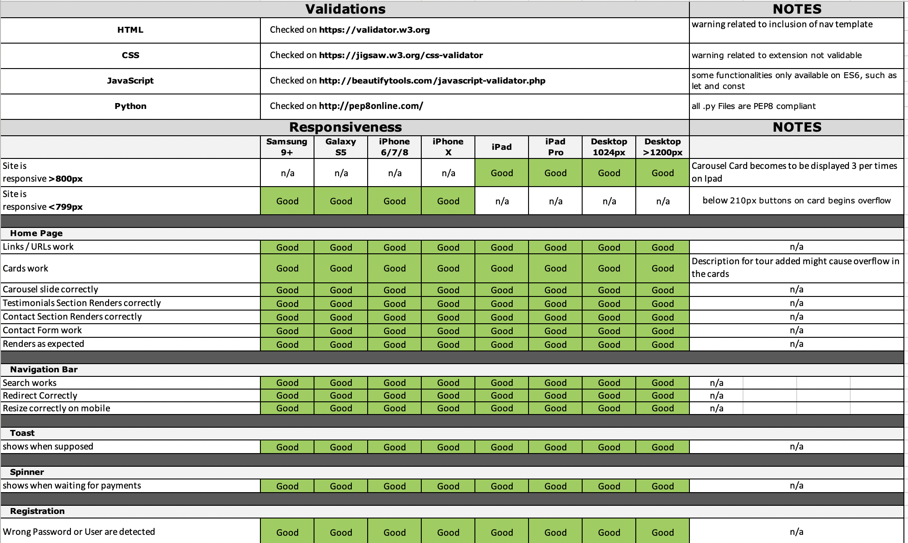

1. [Testing](#testing)
    - [Manual Testing](#manual-testing)
    - [Bugs](#bug)

# Testing

## Manual Testing

I used following validators to check the validity of the website code:

* **CSS**: [W3C CSS Validation Service](https://jigsaw.w3.org/css-validator/) 
* **HTML**: [W3C Markup Validation Service](https://validator.w3.org/)
* **JavaScript**: [JavaScript Beautify Tools](http://beautifytools.com/javascript-validator.php)
* **Python**: [PEP8 online tools](http://pep8online.com/)

For JavaScript and Python I also used extension of **Visual Studio Code**; the work has been reviewed by a number of relatives and friend, mostly on the mobile, each of them giving suggestions.

The website has been tested with multiple resizing to test the its responsiveness; via the *inspect* **chrome devtool** functionality,  it has been examined for the most popular mobile devices such as 

* Samsung 9+
* iPhone 6/7/8
* iPhone X
* iPad
* iPad Pro
* Galaxy S5

also following section has been tested:

1. Navbar: navigating through different pages, including home pages, ensuring that, being *sticky*, was never overlapping any content. In particular it was checked if responds in the correct way and if search functionalities are redirecting correctly via following Routine:
    - Calling different games, and seeing the results displayed properly in cards. 
    - Checking that **empty results** are showed differently. 
    - Checking also that the search on landing page works properly.

1. Footer: checking if footer was standing on the bottom of the page, never overlaying other content and that all its links were working properly.

1. Spinner: ensuring that spinner display correctly while the payment is processed

1. Landing Page, via the following routine
    - **Hot Tour Carousel** is showing me the resultes of `Hot API` call, and responds correctly to screen resizing, and the Tour shown are the top 8 in rating.
    - **Testimonials Section** is responsive and its cards don't overlap.
    - **Contact Section** via the following routine:
        1. Going to the "Contact" Section.
        2. Trying to submit the empty form and verify that an error message about the required fields appears.
        3. Trying to submit the form with an invalid email address and verify that a relevant error message appears.
        4. Trying to submit the form with all inputs valid and verify that the mail is sent correctly.

1. Login, checking it works, and I'm prevent to access with wrong or not-existing user/password couple.

1. Registration, checking it works, and I'm prevent to register with already used username or mail.

1. Tour Page, via the following routine:
    - Checking that *empty results* are shown correctly
    - Checking that badge button related to categories are shown correctly.
    - Checking that Ordering via Drop down menu is working correctly and Tours are Ordered Correctly.
    - Checking that number of Tours are Displayed Correctly on Left Corner.
    - Checking that Card are clickable and redirect to the Tour Detail page.

1. Tour Detail Page, via the following routine:
    - Checking that all details are displayed properly.
    - Checking that I can edit Tour if I'm Superuser in.
    - Checking that I can delete Tour if I'm Superuser in.
    - Checking that I can add it to the card, selecting the number of participants.

1. Tour Management, via the following routine:
    - Checking that all details are displayed properly.
    - Checking that I can edit Categories, Ratings, Duration.
    - Checking that I can upload picture or modify them.

1. Account Page, via the following routine:
    - Checking whether allows to change User's Profile
    - Checking whether reflects change on the latest order.
    - Checking whether the order history is displayed correctly.

1. Cart Page, via the following routine:
    - Checking that all order details are displayed properly.
    - Checking that I can edit an order increasing the number of participants.
    - Checking I'm redirected correctly to the checkout.

1. Checkout Page, via the following routine:
    - Checking that all Billing Details are populated properly.
    - Checking that the orders details are displayed properly.
    - Checking that Stripe Box works correctly, validating the Credit Card.
    - Checking that the payment is sent for Processing.

1. Checkout Process, via the following routine:
    - Checking that the Order is received correctly by Stripe.
    - Checking that the webhook works successfully and process payment succeeded or not.
    - Checking that summary mail is sent to the user in case payment succeeded.

I kept track of all the test on this [matrix](test/manualTests.xlsx)

## Bugs

Most of the bugs were related to the **STRIPE** functionality and how the Webhook was connected to Gmail Account. Code would benefit of a refactoring, allowing better control of the sendmail functionalities. I spent a lot of time trying to get Gmail sending the mail correctly. 
Other bugs were related to the distribution of static files on each application, that seemed to work only when correct configuration of Django was adopted.